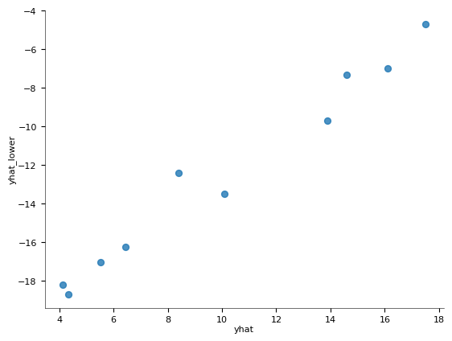
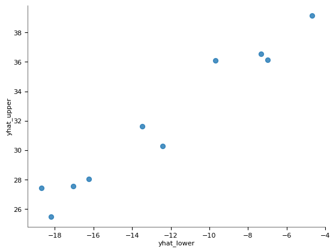
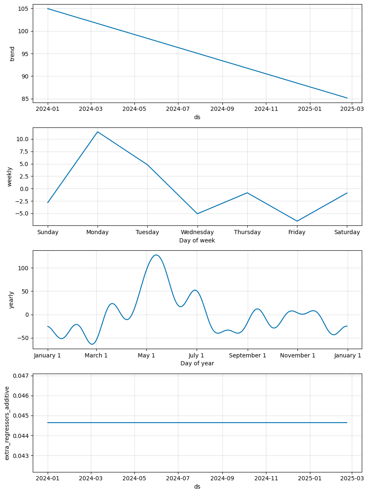

# 📸 Project Images Gallery

This folder contains all the images, screenshots, and visual assets for the AQI Prediction System project. Below is a gallery of all images with direct links to view them.

## 🖼️ Image Gallery

### Project Screenshots
| Image | Description | Direct Link |
|-------|-------------|-------------|
|  | **Project Collage** - Overview of the application | [View collage.png](collage.png) |
|  | **Desktop View** - Application running on desktop | [View desktop01.jpg](desktop01.jpg) |
|  | **Sample Data** - Example data visualization | [View sample01.png](sample01.png) |

### Application Screens
| Image | Description | Direct Link |
|-------|-------------|-------------|
|  | **Main Dashboard** - Primary interface view | [View screen 01.png](screen%2001.png) |
|  | **Data Analysis** - Analytical tools and charts | [View screen02.png](screen02.png) |
|  | **Map Interface** - Geographical data visualization | [View screen03.png](screen03.png) |

### Download Assets
| Image | Description | Direct Link |
|-------|-------------|-------------|
|  | **Asset 01** - UI component or icon | [View download01.png](download01.png) |
|  | **Asset 02** - UI component or icon | [View download02.png](download02.png) |
|  | **Asset 03** - UI component or icon | [View download03.png](download03.png) |
|  | **Asset 04** - UI component or icon | [View download04.png](download04.png) |
|  | **Asset 05** - UI component or icon | [View download05.png](download05.png) |
|  | **Asset 06** - UI component or icon | [View download06.png](download06.png) |
|  | **Asset 07** - UI component or icon | [View download07.png](download07.png) |
|  | **Asset 08** - UI component or icon | [View download08.png](download08.png) |
|  | **Asset 09** - UI component or icon | [View download09.png](download09.png) |
|  | **Asset 10** - UI component or icon | [View download10.png](download10.png) |
|  | **Asset 11** - UI component or icon | [View download11.png](download11.png) |
|  | **Asset 12** - UI component or icon | [View download12.png](download12.png) |
|  | **Asset 13** - UI component or icon | [View download13.png](download13.png) |
|  | **Asset 14** - UI component or icon | [View download14.png](download14.png) |

### Monitoring & Technical Diagrams
| Image | Description | Direct Link |
|-------|-------------|-------------|
|  | **OEE Monitoring** - Operational efficiency dashboard | [View Oee-monitoring.png](Oee-monitoring.png) |
|  | **Technical Diagram** - System architecture or flow | [View Picture10.png](Picture10.png) |

### Live Demo Screenshots
| Image | Description | Direct Link |
|-------|-------------|-------------|
|  | **Live Demo 1** - Application running on render.com | [View screencapture-isro-hackathon-onrender-2025-07-09-12_26_28.png](screencapture-isro-hackathon-onrender-2025-07-09-12_26_28.png) |
|  | **Live Demo 2** - Application features | [View screencapture-isro-hackathon-onrender-2025-07-09-12_29_35.png](screencapture-isro-hackathon-onrender-2025-07-09-12_29_35.png) |
|  | **Live Demo 3** - Additional functionality | [View screencapture-isro-hackathon-onrender-2025-07-09-12_30_46.png](screencapture-isro-hackathon-onrender-2025-07-09-12_30_46.png) |

## 📋 Image Information

**Total Images:** 25 files
**Formats:** PNG (20), JPG (1), [Screen captures (4)]

## 🎯 Usage

These images are used for:
- 📊 Project documentation and README
- 🎨 Application screenshots and demos
- 📈 Presentation materials
- 🏆 Hackathon submission assets
- 📱 Social media and promotional content

## 🔗 How to Use

1. **View an image**: Click on any "View [filename]" link above
2. **Download**: Right-click on any image and select "Save image as"
3. **Embed in documentation**: Use the relative path `images/filename.ext`

## 📝 Notes

- All images are optimized for web viewing
- File names are descriptive of their content
- Images are organized by type and purpose
- Some images may contain sensitive data - review before public sharing

## 📞 Support

If you need additional images or have questions about specific assets, please contact the project maintainers.

---

*Last updated: $(date)*
